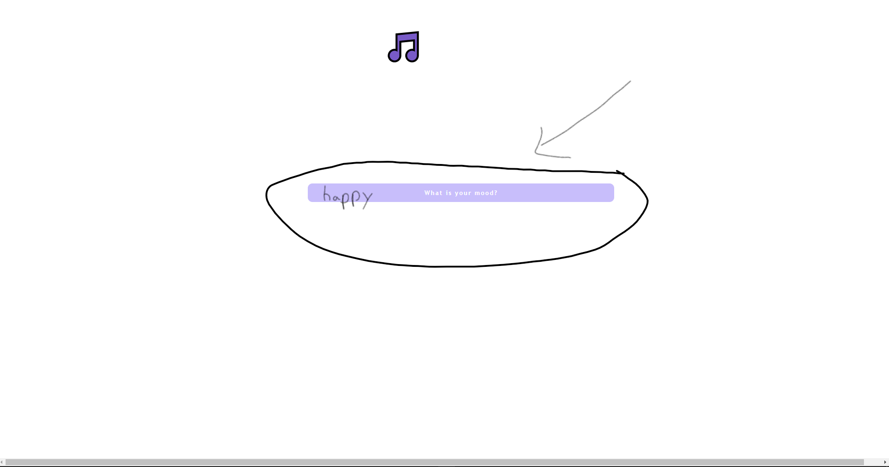

# Project name : MAIMUSIC

# User Story:

- As a music enthusiast, I want to visit a website where I can put in my mood and get a playlist that matches my mood

- When I access MaiMusic I am presented with a prompt to type in my mood

- After putting in my mood, I am presented with a playlist with songs that match my mood and links to Youtube videos to watch and listen to the songs

# Usage:
1. open the website : https://jbarberisv.github.io/Beatview/
2. type in your mood or how you feel in this box:

3. It will show 5 songs with Youtube link.
4. click on the Youtube link and enjoy.

# API :
1. ChatGPT API
2. Youtube API

# Credit:
1. Duc Tran
2. Dimas Leal
3. Andres Rodriguez
4. Joaquin Barberis
5. Qwentin Dobbs 
